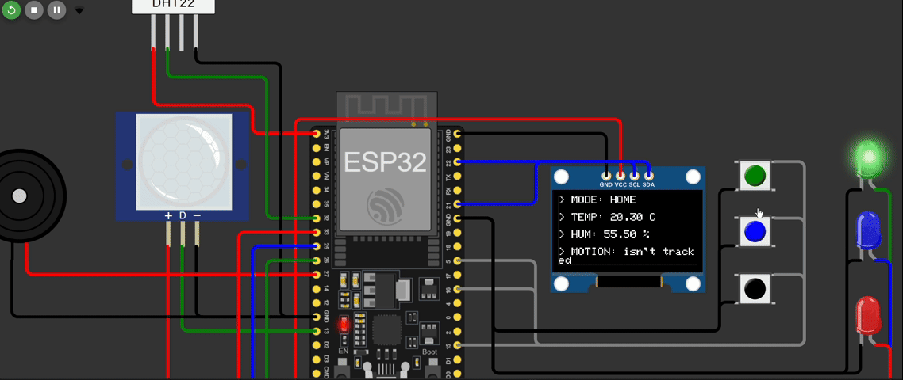

# ESP32 Smart Home Controller

A smart home controller based on ESP32, FreeRTOS and Telegram Bot.

## Demo

## Features

- DHT22 temperature and humidity monitoring
- PIR motion detection
- OLED display
- RGB LED status indication
- Buzzer notifications
- Button control
- Wi-Fi connectivity
- Telegram notifications
- Finite State Machine (FSM)
- FreeRTOS Tasks and Queues

## Hardware

The project is built around an ESP32 DevKit and includes the following components:

| Component | ESP32 Pin | Purpose |
|---|---:|---|
| SSD1306 OLED | GPIO 21 (SDA), GPIO 22 (SCL) | System information display |
| DHT22 | GPIO 32 | Temperature and humidity monitoring |
| PIR Motion Sensor | GPIO 13 | Motion detection |
| Button 1 | GPIO 15 | User input |
| Button 2 | GPIO 16 | User input |
| Button 3 | GPIO 5 | User input |
| Buzzer | GPIO 27 | Audio notifications |
| Green LED | GPIO 26 | Status indication |
| Blue LED | GPIO 25 | Status indication |
| Red LED | GPIO 33 | Status indication |

### Additional Components

- 3 × 1 kΩ resistors for LEDs
- ESP32 DevKit V4
- SSD1306 OLED display (I²C, address `0x3C`)